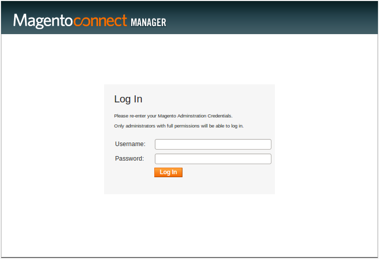
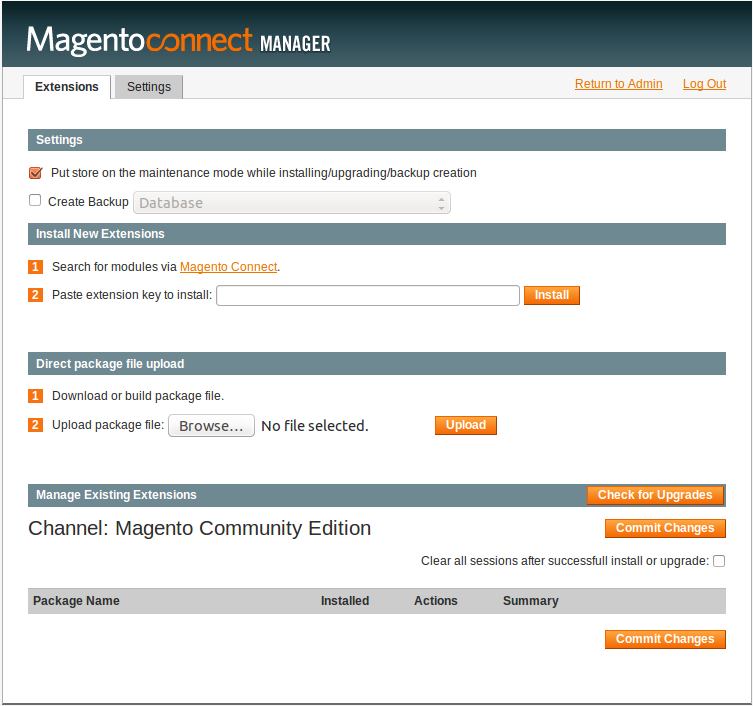
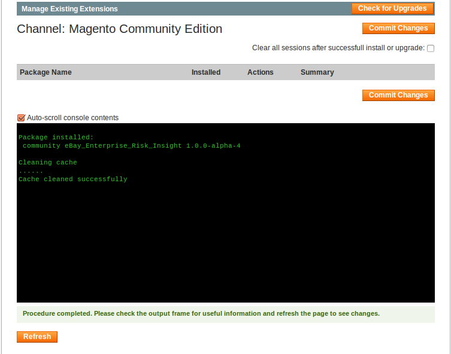
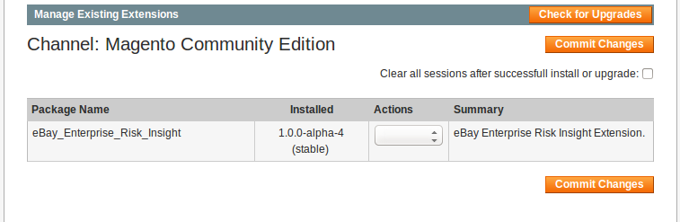
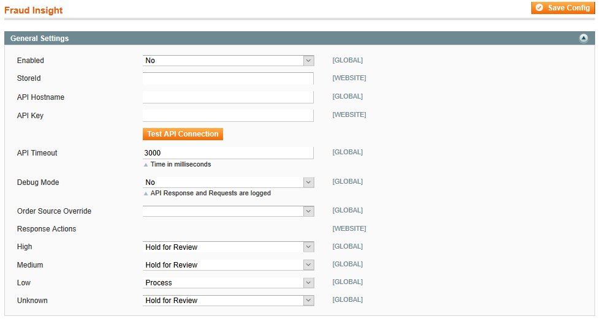

# Radial Fraud Insight Extension

The Fraud Insight Extension enabled automatic high to low fraud transaction detection.

1. Automated integration and on-boarding
1. Flexible configuration

## How to get started:

1. Install extension from the Magento Connect store
1. Under System Configuration, you'll find Radial on the left hand navigation pane. Click to begin Fraud Insight installation.
1. Select “Yes” to enable Fraud Insight Extension.
1. Insert your store id into the extension.
1. Insert your Hostname into the extension.
1. Insert your API Key into the extension.
1. Insert an API Timeout or leave the default.
1. Select "Yes" or "No" if you wish to log Request/Response Payload to Fraud Insight Web service.
1. Select an Order Source Override or leave blank.
1. Under the Response Actions are 4 select box for each possible response returned by the Fraud Insight API (HIGH, MEDIUM, LOW, UNKNOWN) and for each response you can choose to Process, Hold for Review or Cancel and order.
1. Place test transaction to confirm installation.


## How to get Fraud Insight API Credentials


- Please contact [sales@radial.com](mailto:sales@radial.com) to get Fraud Insight API Hostname, API Key and Store Id in order to configure your extension.


## How to install the Fraud Insight Extension on a Vanilla Magento Webstore


Assumption: you are on a Linux system with `Apache`, `PHP`, `MySQL` and `git` installed.


### Recommended option: Installing the Fraud Insight Extension using composer


#### STEP 1: Install composer in your system, [Click Here](https://getcomposer.org/doc/00-intro.md#installation-linux-unix-osx)


#### STEP 2: Create a composer.json file in the root folder of your Vanilla Magento Store
```json
{
    "name": "radial/magento-with-fraud-insight",
    "description": "Installation of the Radial Fraud Insight Extension in Magento",
    "license": "proprietary",
    "type": "project",
    "require": {
        "radial/magento-fraud-insight": "dev-master"
    },
    "minimum-stability": "dev",
    "prefer-stable": true,
    "repositories": [
        {
            "type": "vcs",
            "url": "https://github.com/RadialCorp/magento-fraud-insight.git"
        },
        {
            "type": "composer",
            "url": "http://packages.firegento.com"
        }
    ],
    "extra": {
        "magento-deploystrategy": "copy",
        "magento-root-dir": "./"
    }
}
```


#### STEP 3: run the following command `composer install`, if run successfully you should be able to configure Fraud Insight Setting from Admin.


### Alternate option: Installing the Fraud Insight Extension using Magento Connect Manager


#### STEP 1: Clone the `magento-fraud-insight` repository from GitHub
- You need `git` install on your environment
- Run command: `git clone https://github.com/RadialCorp/magento-fraud-insight.git`


#### STEP 2: Use the `MagentoTarToConnect` tool to create Magento Connect Archive of the Fraud Insight Extension
- Clone the `MagentoTarToConnect` repository from the public github
- Run command: `git clone https://github.com/astorm/MagentoTarToConnect.git`


#### STEP 3: Creating Magento Compatible Tarball of the Fraud Insight Extension
- `CD` to where you clone the `magento-fraud-insight` repository
- Run command: `php /path/to/MagentoTarToConnect/magento-tar-to-connect.php deploy/extension-config.php`
- The command above will create a `build` directory under the current `magento-fraud-insight` directory
- In the `build` directory there will be an `Radial_Fraud_Insight_Extension.tar` file


#### STEP 4: Installing the Fraud Insight Extension in your Vanilla Magento Webstore
- Navigate to this URL in your webstore `http://<webstore-domain>.com/downloader/`
- 
- Enter the same user name and password you use to login into admin of your webstore
- After successfully logged in, make sure under the `Manage Existing Extensions` you see the text `Channel: Magento Community Edition`
- 
- if you do not see the text `Channel: Magento Community Edition`, then, you need to `cd` into where your Magento webstore php files are being hosted in the server if you have access, then you can run the following commands: `./mage && ./mage mage-setup`
- Under the `Direct package file upload` you can browse and upload the `Radial_Fraud_Insight_Extension.tar` file, then click the upload button and after successfully uploaded the Fraud Insight Extension you can click on the refresh button.
- 
- Fraud Insight Extension was successfully installed
- 
- Now, you can log out of Magento Connect Manager and go back to the admin `http://<webstore-domain>.com/admin/`, then login into admin and then navigate to `System > Configuration`.
- In the configuration page, you should see the `RADIAL` tab and under that tab is the `Fraud Insight` configurations. Click the `General Settings` sub-tab.
- 
- Enter configuration information for Fraud Insight Extension
- 

---
Copyright &copy; 2016 Radial, Inc.
